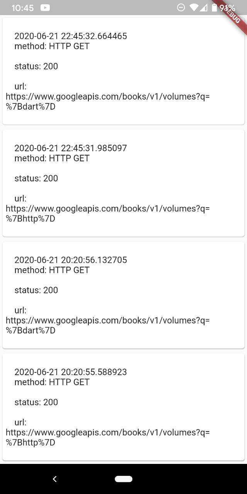

# http_ui_logger

This package is a simple http inspector for [dart http](https://github.com/dart-lang/http) clients.
It intercepts and stores all HTTP responses (including their requests) inside your application,
and provides a UI for inspecting their content.

## Using

### Intercept requests

You have two options:

  * Create a logger client:

```dart
import 'package:http_ui_logger/LoggerClient.dart';

...

final client = LoggerClient.client()

//sample request
client.get('https://www.googleapis.com/books/v1/volumes?q={http}');
```

  * Wrap your own client:

```dart
import 'package:http_ui_logger/LoggerClient.dart';

...

final client = LoggerClient.wrap(yourClient)

//sample request
client.get('https://www.googleapis.com/books/v1/volumes?q={http}');
```

the client is a simple client from http library wrapped by interceptor.

### Visualize

When you want to see requests made, simply push a `ResponseListWidget`
widget with used client to the screen:

```dart
import 'package:http_ui_logger/LoggerClient.dart';
import 'package:http_ui_logger/ResponseListWidget.dart';

...

Navigator.push(
    context,
    MaterialPageRoute(builder: (context) => ResponseListWidget(client)
);
```




